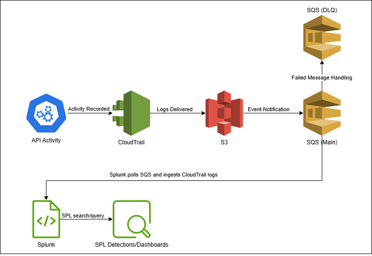
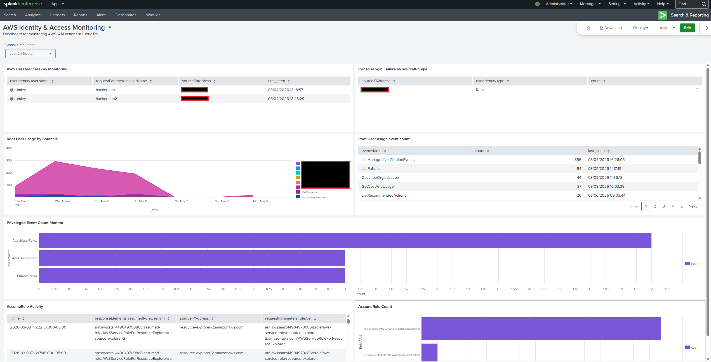

# Cloud SIEM Detection Engineering Project  
AWS CloudTrail + Splunk (SQS-Based S3 Ingestion)

## Overview

This project simulates a cloud security monitoring pipeline using AWS CloudTrail logs ingested into Splunk through an SQS-based S3 architecture.

The objective is to design and implement practical cloud detection logic focused on IAM abuse, privilege escalation, and suspicious activity within AWS environments.

This lab models a real-world security engineering workflow including:

- Log ingestion and indexing
- SPL-based detection engineering
- Alert and dashboard creation
- Security investigation workflows

---

## Architecture

CloudTrail → S3 → SQS → Splunk → Detection Logic

### Components

- **AWS CloudTrail**
  - Management events enabled
  - Logs delivered to S3

- **Amazon S3**
  - Stores CloudTrail JSON log files

- **Amazon SQS (Main Queue)**
  - Receives S3 event notifications

- **Amazon SQS (Dead Letter Queue)**
  - Captures failed ingestion events
  - Prevents silent data loss

- **Splunk Enterprise (Trial)**
  - SQS-based S3 input configured
  - Dedicated `cloudtrail` index
  - Sourcetype: `aws:cloudtrail`



---

## Log Ingestion Details

- Input Type: SQS-Based S3
- Index: `cloudtrail`
- Sourcetype: `aws:cloudtrail`
- Region: us-east-1
- License: Splunk Enterprise Trial

Validation Query:

```spl
index=cloudtrail | stats count by eventSource
```

---

## Search & Detections

- `iam_access_key_creation.spl`: Used to create Alert and Dashboard item for tracking events on CreateAccessKey
- `iam_root_user_actions_count.spl`: Used to create table to give count of all actions from root user and time of most recent occurrence of event
- `iam_root_user_usage_sourceip.spl`: Used to create area chart to show usage of root user by sourceIP to check for spikes and unknown IP addresses
- `iam_consolelogin_failure_count.spl`: Used to create table tracking failed login attempts by sourceIP and user type
- `iam_privileged_event_monitor.spl`: Used to track specific high privileged events by count
- `iam_assume_role_activity.spl`: Used to create table of AssumeRole activity by user/source/role
- `iam_assume_role_count.spl`: Used to track count of how many times a role has been assumed

See the MITRE ATT&CK technique mappings for these detections here:

[`detections/mitre_mapping.md`](detections/mitre_mapping.md)

---

## Sample Dashboard

Splunk dashboard create through this project using the above searches and detections



---

## Technologies Used & Lessons Learned

Here are the different technologies used in this project:

- AWS CloudTrail
- Amazon S3
- Amazon SQS
- AWS CLI
- Splunk Enterprise (trial)
- Splunk Processing Language
- draw.io

Lessons Learned:

- How CloudTrail logs represent AWS API activity
- Event-driven log ingestion pipelines using S3 and SQS
- Writing effective SPL queries to detect suspicious behavior
- Mapping detections to MITRE ATT&CK techniques
- Structuring detection engineering workflows similar to real production environments